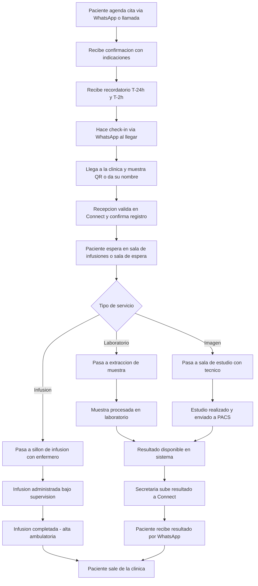

# 01 · Journey del paciente ambulatorio (genérico)

> **Contexto:** Clínica CEI Ambulatoria · **Actor:** Paciente · **v1**
> Aplica a ambos modelos (organic y inorganic). Las variantes específicas están en journeys 02 y 03.

## 1. Propósito
Describir el flujo end-to-end del paciente desde que decide atenderse en la clínica hasta que sale con su resultado o tratamiento completo. Este es el journey de referencia para diseño de procesos y experiencia.

## 2. Precondiciones
- Cita agendada (por bot o secretaria)
- Pre-autorización tramitada si aplica
- Paciente con expediente en Muguerza Connect

## 3. Happy path

## 4. Descripción por etapa

| Etapa | Responsable | Herramienta | Duración esperada |
|---|---|---|---|
| Agendado | Bot / Secretaria | WhatsApp / Connect | 2–5 min |
| Pre-autorización | Secretaria | Connect + aseguradora | <24 h antes |
| Recordatorio | Bot automático | WhatsApp | T-24h y T-2h |
| Check-in | Paciente / Bot | WhatsApp | <30 s |
| Recepción clínica | Recepcionista | Connect | <3 min |
| Espera | — | Sala clínica | <15 min (meta) |
| Servicio clínico | Técnico / Enfermero | Equipo clínico | Variable |
| Resultado / Alta | Secretaria + Bot | Connect + WhatsApp | <5 min post-servicio |

## 5. Principios de experiencia no negociables
1. **El paciente no espera más de 15 min** antes de ser atendido.
2. **El paciente nunca gestiona papelería de aseguradora** — la absorbe la clínica.
3. **El resultado llega por WhatsApp** sin que el paciente lo solicite.
4. **El ambiente no debe sentirse como hospital:** luz natural, silencio controlado, sillones cómodos.
5. **En caso de complicación**, el protocolo de escalación al hospital hub debe tomar menos de 10 min.

## 6. Edge cases

| # | Caso | Manejo |
|---|---|---|
| E1 | Paciente llega sin cita (walk-in) | Secretaria verifica disponibilidad y crea cita en el momento |
| E2 | Paciente llega sin los ayunos o preparación requerida | Informar y ofrecer reagendar mismo día si hay slot |
| E3 | Complicación durante infusión | Activar protocolo de escalación al hub hospitalario |
| E4 | Equipo no disponible (falla técnica de imagen) | Reagendar con disculpa + prioridad en próximo slot |
| E5 | Resultado del lab tarda más de lo previsto | Notificar al paciente el retraso por WhatsApp |
| E6 | Paciente quiere resultados impresos | Recepción imprime en el momento |

## 7. Métricas de éxito
- NPS del paciente al salir: >80
- Tiempo espera sala: <15 min (p90)
- Tiempo desde salida de clínica hasta resultado en WhatsApp: <2 h (lab) / <4 h (imagen)
- No-show rate: <10%

## 8. Pendientes / v2
- App de turnos en pantalla de sala
- Encuesta de satisfacción automática por WhatsApp al salir
- Seguimiento de adherencia a tratamiento recurrente
