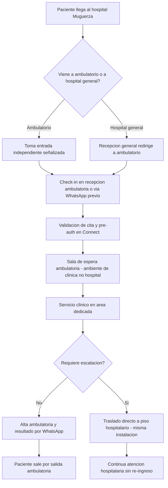

# 02 · Variante Organic — ambulatorio dentro de hospital Muguerza

> **Modelo:** Organic · **Contexto:** Zona ambulatoria dedicada dentro de un Hospital Muguerza existente · **v1**

## 1. Propósito
Describir cómo se adapta el journey genérico (journey 01) cuando la clínica ambulatoria opera como unidad diferenciada dentro de la infraestructura de un hospital Muguerza existente.

## 2. Características del modelo

| Atributo | Detalle |
|---|---|
| Ubicación | Planta baja o ala dedicada de Hospital Muguerza existente |
| Entrada | Entrada independiente al hospital general (señalización separada) |
| Escalación clínica | Escalera o pasillo directo al área hospitalaria — sin transfer externo |
| Estética | Rediseño del área: paleta diferenciada, luz natural, mobiliario cómodo |
| Personal | Equipo propio de la clínica ambulatoria (no comparte personal con hospitalización) |
| Capex | Bajo: obra interior, mobiliario, señalización. Sin construcción nueva. |

## 3. Journey adaptado

## 4. Diferencias clave vs journey genérico

| Aspecto | Genérico | Variante Organic |
|---|---|---|
| Separación física | Asumida | Requiere diseño de señalización y separación de flujos |
| Escalación clínica | Protocolo genérico | Traslado interno (<10 min, sin ambulancia) |
| Identidad visual | CEI Ambulatorio | Subtítulo: «Muguerza Ambulatorio — [Hospital]» |
| Personal | Propio | Propio, con acceso a servicios del hospital en emergencia |
| CAPEX | Referencia | Más bajo: solo adaptación de área existente |

## 5. Riesgos específicos del modelo

| Riesgo | Mitigación |
|---|---|
| Flujos de pacientes mezclados (ambulatorio y hospitalario) | Señalización estricta, entradas físicamente separadas |
| «Se siente como hospital» porque es el mismo edificio | Diseño interior radicalmente distinto, personal diferente |
| Personal de hospital entra a área ambulatoria | Protocolos operativos claros de no-cruce |
| Demoras por uso de recursos compartidos (imagen) | Equipos dedicados al ambulatorio en horario operativo |

## 6. Criterios de éxito del modelo
- Paciente no percibe estar en hospital: validado en encuesta NPS específica
- Tiempo de escalación a hospitalización cuando necesario: <10 min
- Utilización del área: >70% en horario operativo

## 7. Pendientes / v2
- Integración de HIS hospitalario con Connect
- Protocolos de escalación clínica documentados por especialidad
