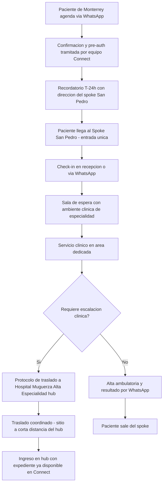
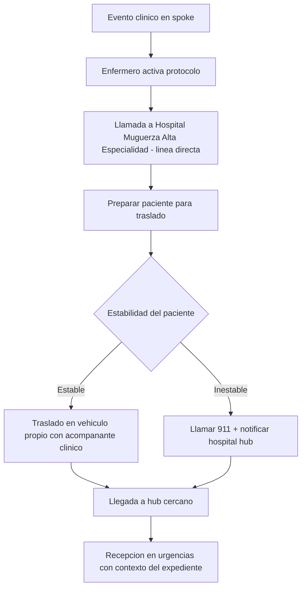

# 03 · Variante Inorganic — Spoke arrendado en Monterrey (San Pedro)

> **Modelo:** Inorganic · **Contexto:** Clínica ambulatoria en sitio arrendado *move-in-ready*, Monterrey / San Pedro Garza García · **v1**

## 1. Propósito
Describir cómo se adapta el journey genérico (journey 01) para el modelo de spoke inorgánico de Monterrey: clínica ambulatoria desplegada en un **sitio arrendado listo para ocupar** (*move-in-ready*), adaptado por **fit-out** (no construcción desde cero), ubicado **cerca de un Hospital Muguerza** que actúa como hub de escalación clínica.

> **Nota de modelo:** este NO es un spoke *greenfield*. La lógica inorgánica del plan es asset-light: espacio, equipo y tecnología **arrendados**, con time-to-market rápido y riesgo financiero menor que una construcción nueva. El business development identificó **tres propiedades move-in-ready** aptas para fit-out, cerca de hospitales Muguerza en San Pedro Garza García.

## 2. Características del modelo

| Atributo | Detalle |
|---|---|
| Ubicación | Monterrey — San Pedro Garza García, corredor AB/C+ (donde vive y se atiende el paciente con seguro privado) |
| Tipo de sitio | Propiedad arrendada *move-in-ready*, adaptada por fit-out bajo contrato de leasing |
| Hub de escalación | Hospital Muguerza Alta Especialidad (ancla del piloto, a corta distancia del spoke) |
| Estética | Fit-out purpose-look: paleta CEI Ambulatoria, diseño inspirado en Alivia — clínica, no hospital |
| Personal | Equipo completo propio desde apertura |
| CAPEX | Asset-light: todo arrendado (espacio, equipo, tecnología); opción de salir si el sitio no rinde |
| Servicios v1 | Especialidad única recomendada: infusiones / oncología (alinea con demanda recurrente y aseguradoras) |

## 3. Journey adaptado

## 4. Diferencias clave vs journey genérico

| Aspecto | Genérico | Variante Inorganic San Pedro |
|---|---|---|
| Escalación | Protocolo genérico | Traslado externo a hub cercano, coordinado |
| Diseño | Estándar CEI | Fit-out de sitio arrendado con look & feel CEI/Alivia |
| Mercado | Monterrey | Monterrey / San Pedro — mercado **core** de Muguerza |
| CAPEX | Referencia | Más bajo: 100% leasing, sin construcción nueva |
| Riesgo | Referencia | Operativo (fit-out a tiempo, captar volumen que hoy se fuga), no de marca |
| Continuidad si falla hub | Hub en mismo edificio | Hub Muguerza cercano, traslado pre-acordado |

## 5. Protocolo de escalación clínica (Spoke San Pedro)

## 6. Riesgos específicos del modelo

| Riesgo | Mitigación |
|---|---|
| Volumen ya capturado por Alivia / Oncare en el corredor | Diferenciar con concierge de aseguradora, red de médicos referentes y precio bundled |
| Fit-out del sitio arrendado no listo a tiempo | Elegir propiedad move-in-ready, alcance de obra acotado, hitos con penalización |
| Bajo volumen inicial | Modelo 100% leasing permite ajustar capacidad y salir del sitio |
| Escalación depende de distancia al hub | Seleccionar sitio a corta distancia de Hospital Muguerza, protocolos pre-acordados y simulacros |

## 7. Hitos del modelo de negocio

| Hito | Métrica | Plazo estimado |
|---|---|---|
| Sitio live y COFEPRIS-compliant | Apertura del primer spoke | ≤ 6 meses |
| Primera ruta de pago con aseguradora (PHI) activa | Bundle / preferente con pagador ancla (vía Sekura) | A la apertura |
| Break-even operativo | ~70% de ocupación | 6–12 meses post-apertura |
| Médicos ancla refiriendo activamente | 3–5 especialistas | Mes 6 |
| Decisión de escalar | Playbook documentado + segundo pagador en proceso | Mes 12 |

## 8. Pendientes / v2
- Cerrar selección entre las tres propiedades move-in-ready identificadas en San Pedro
- Primer bundle de pago con aseguradora ancla (canal Sekura)
- Red de médicos referentes en el corredor San Pedro (equivalente a Soy Doctor)
- Integración de expediente Connect entre spoke y hub en tiempo real
- Definir segundo spoke según resultados del piloto
