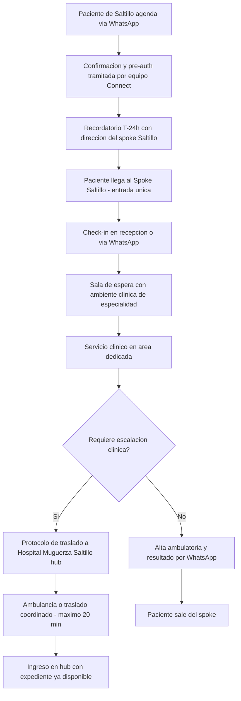
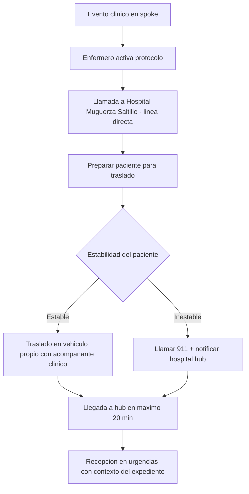

# 03 · Variante Inorganic — Spoke Saltillo (greenfield)

> **Modelo:** Inorganic · **Contexto:** Clínica ambulatoria greenfield, propósito específico, Saltillo · **v1**

## 1. Propósito
Describir cómo se adapta el journey genérico (journey 01) para el modelo de spoke greenfield de Saltillo: clínica de propósito específico, diseñada desde cero, con Hospital Muguerza Saltillo como hub de escalación.

## 2. Características del modelo

| Atributo | Detalle |
|---|---|
| Ubicación | Saltillo — zona Sendero u otro corredor AB/C+ |
| Tipo de sitio | Espacio rentado, equipado bajo contrato de leasing |
| Hub de escalación | Hospital Muguerza Saltillo (traslado en <20 min) |
| Estética | 100% purpose-built: paleta CEI Ambulatoria, diseño inspirado en Alivia |
| Personal | Equipo completo propio desde apertura |
| CAPEX | Asset-light: todo arrendado (espacio, equipo, tecnología) |
| Servicios v1 | Infusiones, laboratorio, imagen básica |

## 3. Journey adaptado

## 4. Diferencias clave vs journey genérico

| Aspecto | Genérico | Variante Inorganic Saltillo |
|---|---|---|
| Escalación | Protocolo genérico | Traslado externo a hub, <20 min, coordinado |
| Diseño | Estándar CEI | 100% desde cero, sin legado hospitalario |
| Mercado | Monterrey | Saltillo — nuevo mercado para CEI |
| CAPEX | Referencia | Más bajo: 100% leasing |
| Riesgo | Referencia | Mayor: mercado nuevo, sin historia de pacientes |
| Continuidad si falla hub | Hub en mismo edificio | Depende de disponibilidad de Muguerza Saltillo |

## 5. Protocolo de escalación clínica (Saltillo)

## 6. Riesgos específicos del modelo

| Riesgo | Mitigación |
|---|---|
| Mercado desconocido en Saltillo | Análisis previo de demanda + alianzas con médicos de Saltillo |
| Escalación más lenta que en modelo organic | Protocolos de traslado pre-acordados con hub, simulacros |
| Bajo volumen inicial | Modelo 100% leasing permite ajustar capacidad |
| Conocimiento de marca en Saltillo | Campaña local + red de médicos referentes |

## 7. Hitos del modelo de negocio

| Hito | Métrica | Plazo estimado |
|---|---|---|
| Break-even operativo | 60–70% de ocupación | 6–12 meses post-apertura |
| Volumen mínimo viable | 25 pacientes/día | Mes 3 |
| NPS objetivo | >80 | Mes 6 |
| Expansión a segundo spoke | Definir según resultados Saltillo | Año 2 |

## 8. Pendientes / v2
- Acuerdos con aseguradoras locales de Saltillo
- Red de médicos referentes en Saltillo (equivalente a Soy Doctor)
- Integración de expediente Connect entre spoke y hub en tiempo real
- Segundo spoke: definir siguiente geografía
