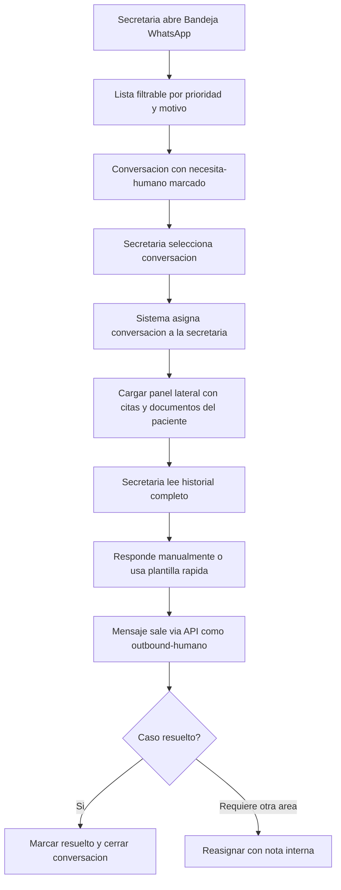

# 01 · Bandeja WhatsApp (CRM) — sección Secretaría

> **Producto:** Muguerza Connect · **Actor:** Secretaria · **v1**

## 1. Propósito
Vista dentro de Muguerza Connect, solo para rol secretaria, conectada vía WhatsApp Business API con el bot Concierge integrado. Es donde la secretaria gestiona las conversaciones que requieren intervención humana.

> El médico NO tiene acceso a esta sección.

## 2. Precondiciones
- Usuario con rol secretaria
- Cuenta WhatsApp Business API conectada
- Bot Concierge desplegado y enviando handoffs

## 3. Layout de la bandeja

```
┌──────────────────────────────────────────────────────────────────────┐
│ Muguerza Connect · Secretaría                        [María López ▾] │
├──────────────────────────────────────────────────────────────────────┤
│ [Dashboard]  [Agenda]  [📨 Bandeja  •12]  [Docs]  [Reportes]        │
├────────────┬──────────────────────────────┬─────────────────────────┤
│ FILTROS    │  CONVERSACIONES (12 abiertas) │  CHAT + CONTEXTO        │
│            │                              │                         │
│ Todas      │ 🔴 Ana López      hace 1 min  │  Ana López              │
│ Sin asignar│  "me duele la espalda..."    │  +52 81 1234 5678       │
│ Mías       │  Sin asignar · Urgente       │  [Ver expediente]       │
│            │                              │  ──────────────         │
│ Prioridad: │ 🟡 Carlos Ruiz    hace 5 min  │  Próxima cita:          │
│ Urgente    │  "puedo cambiar mi cita?"    │  Mié 27 may · 7:30am    │
│ Alta       │  Asignada · Normal           │  Química 27 — Sur       │
│ Normal     │                              │  ──────────────         │
│            │ 🟢 María T.       Bot resuelto│  Conversación:          │
│ Motivo:    │  "gracias!"                  │  🤖 Hola Ana...          │
│ Aseguradora│                              │  👤 hola                 │
│ Consulta   │                              │  🤖 En qué te ayudo...   │
│ Documento  │                              │  ──────────────         │
│ Fallo bot  │                              │  [ Responder...     ▶ ] │
└────────────┴──────────────────────────────┴─────────────────────────┘
```

## 4. Happy path



## 5. Acciones disponibles para la secretaria

| Acción | Descripción |
|---|---|
| Tomar conversación | Asignarse la conversación, visible para demás secretarias |
| Responder | Enviar mensaje vía WhatsApp Business API |
| Adjuntar archivo | PDF o imagen directo al paciente |
| Plantilla rápida | Insertar texto predefinido (dirección, instrucciones) |
| Crear cita | Modal sin salir del chat (journey 02) |
| Subir documento al expediente | Asociar doc que paciente envió (journey 03) |
| Reasignar | A otra secretaria o supervisor |
| Nota interna | Visible solo en CRM, no llega al paciente |
| Cerrar conversación | Marcar resuelta, opcionalmente devolver al bot |
| Devolver al bot | Bot retoma con needs_human = false |

## 6. Edge cases

| # | Caso | Manejo |
|---|---|---|
| E1 | Dos secretarias abren mismo chat | Lock: la primera en tomar la asigna; la segunda ve aviso |
| E2 | Paciente escribe mientras secretaria redacta | Notificación de nuevo mensaje sin perder el borrador |
| E3 | Mensaje saliente falla (número bloqueado) | Error visible en chat, marcar whatsapp_blocked en paciente |
| E4 | Ventana 24h cerrada sin mensaje del paciente | Forzar uso de plantilla HSM pre-aprobada |
| E5 | Secretaria acaba turno con chats abiertos | Sistema sugiere reasignar; supervisor ve huérfanos |

## 7. Permisos
- `secretary` → ve conversaciones de su clínica, puede tomar y reasignar dentro de ella
- `secretary_supervisor` → ve todas las clínicas
- `doctor` → sin acceso (pestaña no visible)
- `admin` → lectura de auditoría, no responde

## 8. Pendientes / v2
- AI assist con sugerencia de respuesta
- Auto-asignación por carga
- Multi-canal (Instagram DM, web chat)
- Notificación móvil (PWA)
