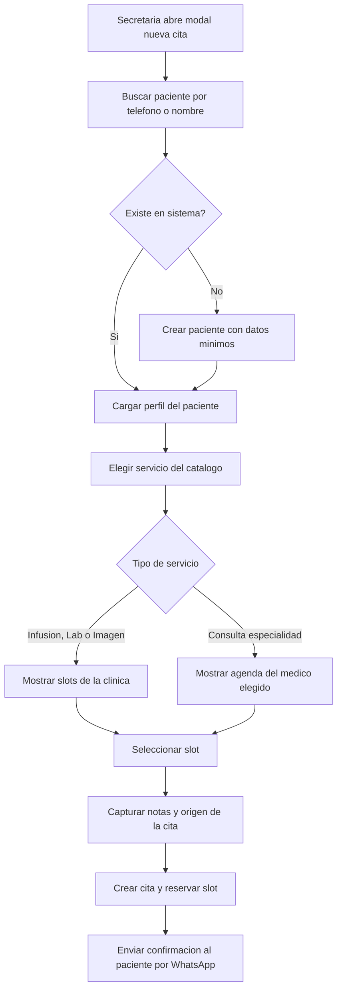

# 02 · Gestión de citas desde CRM

> **Producto:** Muguerza Connect · **Actor:** Secretaria · **v1**

## 1. Propósito
Crear, editar, reagendar o cancelar citas manualmente desde Connect. Aplica a citas originadas por llamada, handoff del bot, walk-in o consulta de especialidad.

## 2. Precondiciones
- Usuario con rol secretaria
- Catálogo de servicios y disponibilidad cargado

## 3. Happy path

## 4. Acciones sobre cita existente

- **Editar** (hora, clínica, servicio) — queda en audit log
- **Reagendar** — libera slot, reserva nuevo, notifica al paciente
- **Cancelar** — con motivo obligatorio, notifica al paciente
- **Marcar no-show** — al cierre del día
- **Convertir a recurrente** — series de infusión cada X días
- **Adjuntar documentos** — receta u orden médica

## 5. Edge cases

| # | Caso | Manejo |
|---|---|---|
| E1 | Paciente sin nombre completo o sin INE | Permitir con datos mínimos, perfil marcado como incompleto |
| E2 | Slot tomado al confirmar | Recargar disponibilidad automáticamente |
| E3 | Fuera de horario operativo | Bloquear con mensaje claro |
| E4 | Servicio requiere referencia y no la tienen | Crear cita con flag pendiente de referencia |
| E5 | Cita con aseguradora sin póliza validada | Crear cita y generar tarea de preauth (journey 03) |
| E6 | Dos citas del mismo día para el paciente | Advertir pero permitir |
| E7 | Edición de cita ya confirmada por paciente | Notificar el cambio al paciente por WhatsApp |

## 6. Métricas de éxito
- Tiempo promedio de creación manual: <60 s
- Porcentaje citas creadas por bot vs manual: seguimiento mensual

## 7. Pendientes / v2
- Vista de calendario con drag-and-drop
- Programación de series recurrentes completas en un flow
- Bloqueos de agenda por vacaciones o mantenimiento
