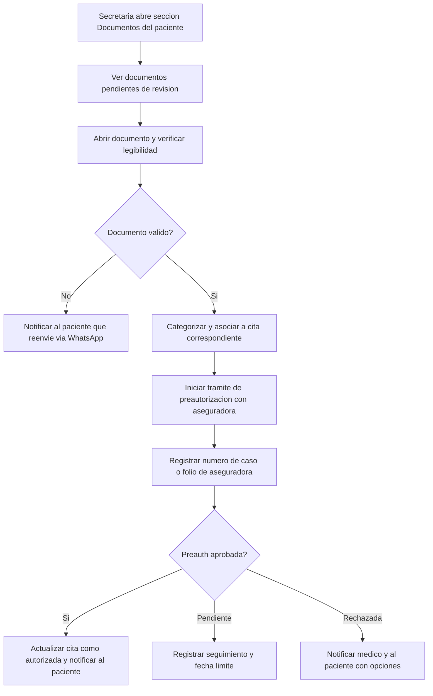

# 03 · Intake de documentos y pre-autorización (secretaria)

> **Producto:** Muguerza Connect · **Actor:** Secretaria · **v1**

## 1. Propósito
Gestionar los documentos del paciente que llegaron vía WhatsApp o que la secretaria sube manualmente, y tramitar la pre-autorización con la aseguradora antes de la cita.

## 2. Precondiciones
- Cita creada con aseguradora indicada
- Documentos en cola de revisión (de journey WhatsApp 06) o a subir manualmente

## 3. Happy path

## 4. Mensajes al paciente desde la bandeja

La secretaria puede enviar directamente desde la conversación en CRM:

> «Hola Ana, revisé tu póliza. Tu cita del mié 27 ya está **autorizada** por GNP. ✅ Llega con tu credencial de asegurado.»

> «Hola Ana, necesitamos que reenvíes la receta del Dr. García, la foto está borrosa. ¿La tienes en PDF?»

## 5. Edge cases

| # | Caso | Manejo |
|---|---|---|
| E1 | Aseguradora tarda más de 48h en responder | Registrar en seguimiento, recordatorio automático |
| E2 | Paciente no tiene documento requerido | Secretaria coordina con médico tratante |
| E3 | Preauth rechazada por cobertura | Dar al paciente opción de pago privado |
| E4 | Cita urgente sin tiempo de preauth | Marcar pago privado con posible reembolso posterior |
| E5 | Póliza vencida | Notificar al paciente de inmediato |

## 6. Métricas de éxito
- Tiempo de tramitación preauth: <24 h hábiles
- Porcentaje de citas autorizadas antes de la fecha: >90%
- Documentos validados en menos de 4 h hábiles: >85%

## 7. Pendientes / v2
- Integración directa con portales de aseguradoras (GNP, AXA, MAPFRE)
- Tracking automático de estado de preauth
- Alertas de vencimiento de pólizas
