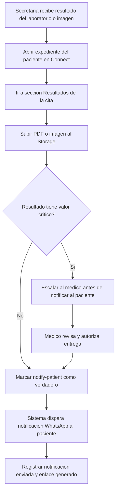

# 04 · Resultados y follow-up (secretaria)

> **Producto:** Muguerza Connect · **Actor:** Secretaria · **v1**

## 1. Propósito
Subir resultados de laboratorio o imagen al expediente del paciente y disparar la notificación automática vía WhatsApp (journey WhatsApp 05).

## 2. Precondiciones
- Cita completada con status checked-out o completada
- Archivo de resultado disponible (PDF del LIS, imagen del PACS o escaneo)

## 3. Happy path

## 4. Criterios de resultado crítico

La secretaria marca como crítico si el resultado incluye:
- Valores fuera de rango de referencia marcados por el laboratorio
- Hallazgos de imagen con nota de urgencia del radiólogo
- Cualquier duda → consultar al médico antes de liberar

## 5. Edge cases

| # | Caso | Manejo |
|---|---|---|
| E1 | Resultado de imagen como DICOM | v1: subir PDF del reporte, no el DICOM bruto |
| E2 | Archivo mayor a 16 MB | Comprimir o dividir antes de subir |
| E3 | Paciente bloqueó el bot | Notificar por llamada o email (datos en expediente) |
| E4 | Médico no disponible para revisar crítico | Escalar a médico de guardia o supervisor |
| E5 | Resultado llega a la clínica equivocada | Reasignar al expediente correcto |

## 6. Métricas de éxito
- Resultados notificados al paciente mismo día: >90%
- Tiempo resultado en sistema a notificación WhatsApp: <5 min
- Resultados críticos escalados a médico antes de entregar: 100%

## 7. Pendientes / v2
- Integración directa con LIS para auto-subida de resultados
- Integración con PACS para imagen
- Resumen automático del resultado para el paciente (con disclaimer)
