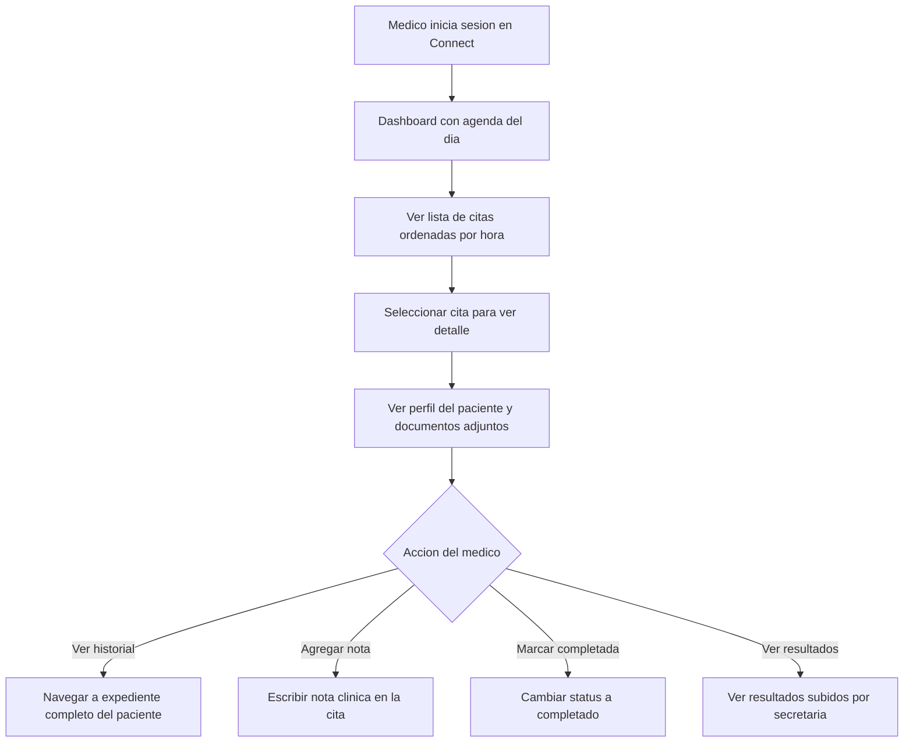
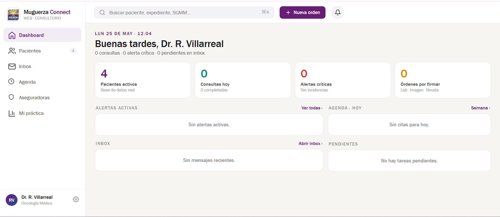

# 05 · Dashboard del médico

> **Producto:** Muguerza Connect · **Actor:** Médico · **v1**

## 1. Propósito

Vista principal del médico en Connect: agenda del día, expedientes de sus pacientes y acceso a historial clínico. Sin acceso a chats de WhatsApp.

## 2. Precondiciones

- Usuario con rol doctor
- Al menos una cita asignada al médico

## 3. Happy path

## 4. Referencia visual del dashboard real

Vista real del dashboard médico en Muguerza Connect: KPIs clínicos, agenda del día, inbox, alertas críticas y órdenes pendientes por firma.

La pantalla funciona como centro de control diario del médico. Prioriza alertas, concentra pendientes y permite saltar rápido hacia pacientes, agenda, inbox, aseguradoras o métricas de práctica.

## 5. Edge cases

| # | Caso | Manejo |
|---|---|---|
| E1 | Médico sin citas hoy | Dashboard vacío con mensaje claro |
| E2 | Paciente llega sin confirmar (no-show dudoso) | Secretaria marca desde su vista; médico ve el status actualizado |
| E3 | Médico quiere ver citas de otra fecha | Filtro de fecha en agenda |
| E4 | Resultado crítico llega mientras médico está en consulta | Badge de notificación en la pestaña Resultados |
| E5 | Médico de guardia ve pacientes de otro médico | Solo si tiene permiso de guardia habilitado por admin |

## 6. Lo que el médico NO ve en v1

- Bandeja de WhatsApp (es exclusiva de secretaria)
- Información financiera o de seguros
- Conversaciones internas del equipo
- Comunicación directa con el paciente (queda pendiente para v2)

## 7. Métricas de éxito

- Tiempo de carga del dashboard: <2 s
- Porcentaje de citas marcadas completadas el mismo día: >85%

## 8. Pendientes / v2

- Canal de comunicación médico-paciente (opción técnica por definir)
- Vista de pacientes con tratamiento recurrente activo
- Notas clínicas estructuradas con plantillas por especialidad
- Firma digital de notas
