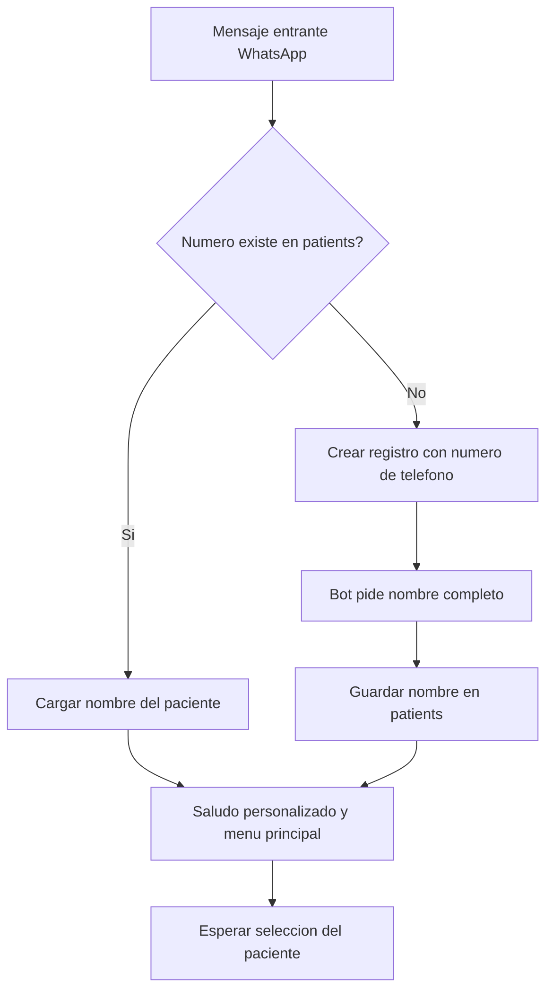

# 00 · Identificación y onboarding del paciente

> **Canal:** WhatsApp Concierge · **Actor:** Paciente · **v1**

## 1. Propósito
Identificar al paciente por número de teléfono en el primer mensaje. Si existe, saludar por nombre y abrir menú. Si no, crear expediente mínimo automáticamente.

## 2. Precondiciones
- Mensaje entrante por WhatsApp Business API
- Número en formato E.164

## 3. Happy path

## 4. Mensajes del bot

**Paciente recurrente:**
> **Bot:** «¡Hola, Ana! 👋 Soy Concierge, tu asistente de Muguerza. ¿En qué te ayudo hoy?
>
> 1️⃣ Agendar cita (infusión, laboratorio, imagen)
> 2️⃣ Cotizar un servicio
> 3️⃣ Reagendar o cancelar
> 4️⃣ Ver mis resultados
> 5️⃣ Enviar un documento
> 6️⃣ Otra cosa / hablar con una persona»

**Paciente nuevo:**
> **Bot:** «¡Hola! 👋 Soy Concierge, el asistente de Muguerza Ambulatorio. Para crear tu expediente, ¿me dices tu nombre completo?»
> **Paciente:** «Ana López Treviño»
> **Bot:** «Gracias, Ana. Listo. ¿En qué te ayudo? [menú principal]»

## 5. Edge cases

| # | Caso | Manejo |
|---|---|---|
| E1 | Mensaje de grupo o lista de difusión | Ignorar, no crear expediente |
| E2 | Nombre enviado inválido (1 char, números) | Reintento máx 2 veces, luego handoff |
| E3 | Paciente con nombre vacío en BD | Pedir nombre como paciente nuevo |
| E4 | Dos personas comparten teléfono familiar | v1: un perfil por teléfono. Nota para v2 |
| E5 | Mensaje inicial es audio o imagen | Pedir texto para identificación |

## 6. Escalación a humano
- **Disparadores:** nombre inválido tras 2 reintentos · petición explícita de persona
- **Mensaje:** «Te paso con una compañera del equipo, te responde en horario hábil. 🙌»
- **CRM:** conversación marcada `needs_human=true`, motivo `onboarding_failed`

## 7. Métricas de éxito
- Tasa de auto-identificación exitosa: >95%
- Tiempo primer mensaje → menú: <30 s
- Pacientes al menú sin handoff: >90%

## 8. Pendientes / v2
- Sub-perfiles para teléfonos familiares
- Validación de nombre contra INE/documento
- Detección de idioma (inglés)
