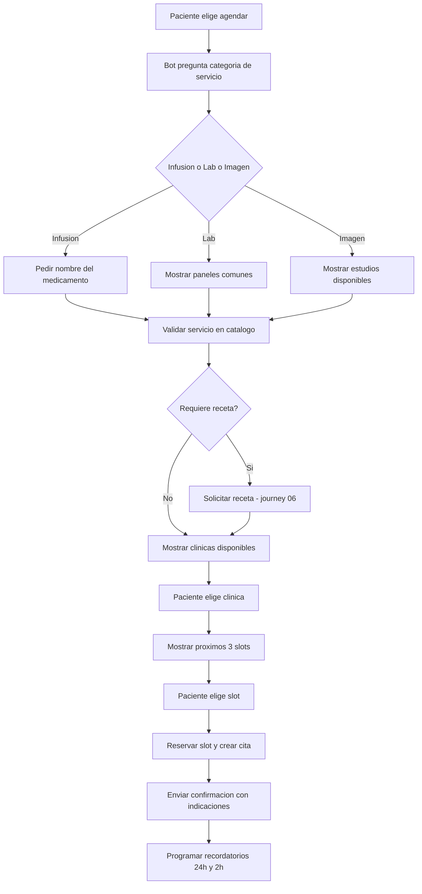

# 01 · Agendar cita (infusión / laboratorio / imagen)

> **Canal:** WhatsApp Concierge · **Actor:** Paciente · **v1**

## 1. Propósito
Permitir al paciente agendar una cita de infusión, laboratorio o imagen por WhatsApp sin llamada ni intervención humana, usando disponibilidad en tiempo real.

## 2. Precondiciones
- Paciente identificado (journey 00)
- Al menos una clínica con slots publicados en el sistema
- Servicio en catálogo bot-eable

## 3. Happy path

## 4. Mensajes del bot

> **Bot:** «¿Qué tipo de servicio buscas?
> 1️⃣ Infusión
> 2️⃣ Laboratorio
> 3️⃣ Imagen (rayos X, ultrasonido, tomografía, resonancia)»

> **Bot:** «Perfecto. Paneles más solicitados:
> • Química sanguínea 27 elementos — $890
> • Biometría hemática — $320
> • Perfil tiroideo — $1,250
> • Otro (escríbeme cuál)»

> **Bot:** «Este estudio requiere **ayuno de 8 horas**. ¿Cuál clínica te queda mejor?
> 📍 Muguerza Alta Especialidad — Hidalgo
> 📍 Muguerza Sur — Contry
> 📍 Spoke San Pedro — Alta Engracia»

> **Bot:** «✅ Cita confirmada:
> **Química 27 elementos** · Mié 27 may · 7:30 a.m.
> 📍 Muguerza Sur — Calzada del Valle 400
> ⚠️ Ayuno 8 horas. Te recuerdo 24 h y 2 h antes.»

## 5. Edge cases

| # | Caso | Manejo |
|---|---|---|
| E1 | Servicio fuera de catálogo bot (cirugía, consulta) | Derivar a secretaria |
| E2 | Sin slots en 7 días en clínica elegida | Sugerir otra clínica o ampliar rango |
| E3 | Slot tomado al momento de confirmar | Reoferta inmediata sin slot ya ocupado |
| E4 | Requiere receta y paciente no la envía en 3 min | Cita en status pendiente, se cancela en 24h |
| E5 | Paciente menor de edad | Handoff para validar tutor |
| E6 | Estudio con preparación especial | Mensaje de instrucciones específicas |
| E7 | Paciente menciona aseguradora | Handoff inmediato |

## 6. Escalación a humano
- **Disparadores:** servicio fuera de catálogo · mención de aseguradora · 3 reintentos
- **Mensaje:** «Te conecto con el equipo para coordinar este detalle.»

## 7. Métricas de éxito
- Conversión flow → cita creada: >70%
- Tiempo del flow: <2 min
- Citas agendadas por bot sin humano: >60% (Q1)

## 8. Pendientes / v2
- Pago anticipado por link (Stripe / Mercado Pago)
- Recomendador de próxima infusión según recurrencia
- Agendado de paquetes
- Geolocalización para sugerir clínica más cercana
