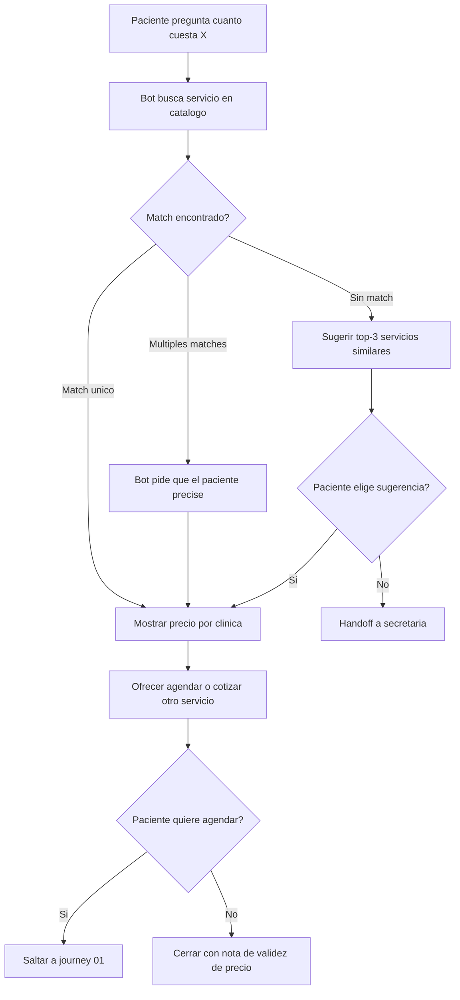

# 02 · Cotizar servicio

> **Canal:** WhatsApp Concierge · **Actor:** Paciente · **v1**

## 1. Propósito
Entregar el precio público (privado, sin aseguradora) de un servicio del catálogo en segundos. Si el paciente menciona aseguradora → handoff.

## 2. Precondiciones
- Paciente identificado (journey 00)
- Catálogo de precios vigente en sistema

## 3. Happy path

## 4. Mensajes del bot

> **Paciente:** «cuanto cuesta una resonancia de rodilla»
> **Bot:** «Encontré esto:
> 🩻 **Resonancia magnética de rodilla** (sin contraste)
> • Muguerza Alta Especialidad: **$6,800**
> • Muguerza Sur: **$6,500**
> • Spoke Saltillo: **$5,900**
> Precios privados vigentes hoy. Si tienes aseguradora, el equipo confirma cobertura.
> ¿Quieres **agendar** ahora?»

## 5. Edge cases

| # | Caso | Manejo |
|---|---|---|
| E1 | Menciona aseguradora | Handoff inmediato |
| E2 | Infusión con precio variable por medicamento | Mostrar rango y pedir medicamento |
| E3 | Precio vencido en catálogo | No mostrar, marcar revisión, handoff |
| E4 | Paquete o chequeo ejecutivo | v1: no soportado, handoff |
| E5 | Cirugía | Handoff |
| E6 | Pregunta sobre MSI o financiamiento | Handoff |

## 6. Escalación a humano
- **Disparadores:** aseguradora · sin match tras desambiguación · paquete · cirugía · MSI
- **Mensaje:** «Te paso al equipo para que te dé la info completa.»

## 7. Métricas de éxito
- Cotizaciones resueltas sin humano: >75%
- Conversión cotización → cita: >25%
- Tiempo promedio: <60 s

## 8. Pendientes / v2
- Cotización estimada con copago de aseguradora
- MSI / financiamiento
- Paquetes y chequeos
