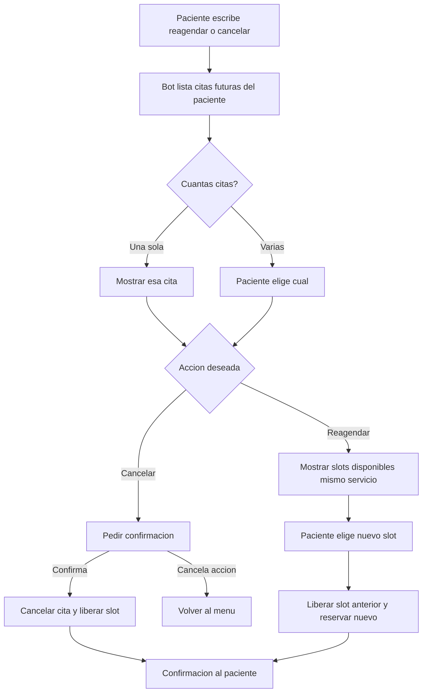

# 03 · Reagendar o cancelar cita

> **Canal:** WhatsApp Concierge · **Actor:** Paciente · **v1**

## 1. Propósito
Permitir al paciente modificar o cancelar una cita existente desde WhatsApp, liberar el slot y aplicar política de cancelación.

## 2. Precondiciones
- Paciente identificado (journey 00)
- Al menos un appointment futuro en sistema

## 3. Happy path

## 4. Mensajes del bot

> **Bot:** «Tienes esta cita próxima:
> 📅 Mié 27 may · 7:30 a.m. — Química 27, Muguerza Sur
> ¿La quieres **cancelar** o **reagendar**?»

> **Bot (reagendar):** «Próximos espacios disponibles en Muguerza Sur:
> 🕗 Jue 28 may · 7:30 a.m.
> 🕘 Vie 29 may · 8:00 a.m.
> 🕗 Sáb 30 may · 7:00 a.m.»

> **Bot (cancelación):** «¿Confirmas la cancelación del **mié 27 may · 7:30 a.m.**? (sí/no)»

## 5. Edge cases

| # | Caso | Manejo |
|---|---|---|
| E1 | Sin citas futuras | Bot ofrece agendar nueva |
| E2 | Cancela con menos de 24h | Aplicar política tardía, registrar lead_time |
| E3 | Sin slots en 7 días | Ofrecer otra clínica o fechas más amplias |
| E4 | Quiere cambiar de servicio al reagendar | Cancelar y abrir journey 01 |
| E5 | Cita en status checked-in o completada | Handoff |
| E6 | Slot tomado en la carrera al confirmar | Reoferta sin el slot ya ocupado |
| E7 | Infusión de serie recurrente | Preguntar si cambia solo esta o toda la serie; serie → handoff |

## 6. Escalación a humano
- **Disparadores:** E5 (en curso) · cambio de serie · reembolso · queja médica
- **Mensaje:** «Te paso al equipo para resolverlo bien.»

## 7. Métricas de éxito
- Reagendados y cancelaciones sin humano: >85%
- Reducción de no-shows tras implementar: ≥30%

## 8. Pendientes / v2
- Cancelación con reembolso automático
- Lista de espera al liberar slot
- Reagendar series completas
