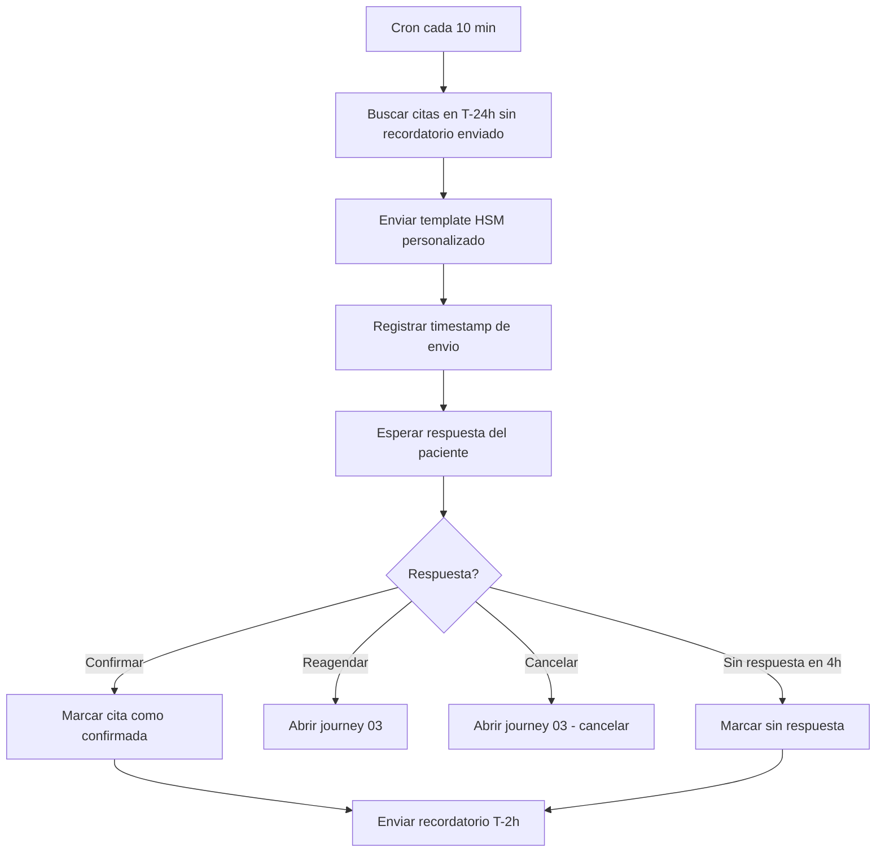

# 04 · Recordatorio de cita (outbound)

> **Canal:** WhatsApp Concierge · **Actor:** Bot → Paciente · **v1**
> **Frecuencia:** 2 envíos por cita (T-24h y T-2h)

## 1. Propósito
Reducir no-shows enviando recordatorios automáticos antes de cada cita, con opción de confirmar, reagendar o cancelar con un tap.

## 2. Precondiciones
- Appointment con status confirmado y fecha futura
- Plantilla HSM aprobada por Meta
- Worker/cron corriendo

## 3. Happy path

## 4. Mensajes del bot

**T-24h:**
> **Bot:** «Hola Ana 👋 Te recuerdo tu cita de mañana:
> 📅 **Mié 27 may · 7:30 a.m.** — Química 27, Muguerza Sur
> ⚠️ Ayuno de 8 horas (puedes tomar agua).
>
> 1️⃣ Confirmar  2️⃣ Reagendar  3️⃣ Cancelar»

**T-2h:**
> **Bot:** «Recordatorio: tu cita es en 2 horas (7:30 a.m. — Muguerza Sur).
> 📍 Calzada del Valle 400 · Llega 15 min antes.
> Si no podrás llegar, escribe *reagendar*.»

## 5. Edge cases

| # | Caso | Manejo |
|---|---|---|
| E1 | Cita cancelada entre T-24h y T-2h | Verificar status antes de enviar T-2h |
| E2 | Respuesta con texto libre | NLU: ok/va/sí → confirmar; no puedo/cambiar → reagendar |
| E3 | Plantilla HSM rechazada por Meta | Log + alerta interna |
| E4 | Paciente bloqueó el número del bot | Marcar whatsapp_blocked, notificar secretaria |
| E5 | Varias citas el mismo día | Un recordatorio por cita |
| E6 | Paciente cancela desde el recordatorio T-2h | Aplicar política tardía |

## 6. Escalación a humano
- **Disparadores:** bloqueo del bot · respuesta con queja o síntoma clínico
- **Mensaje:** «Te paso con el equipo para atenderte.»

## 7. Métricas de éxito
- Confirmación al T-24h: >70%
- Reducción de no-shows vs baseline: ≥40%

## 8. Pendientes / v2
- Instrucciones de preparación personalizadas por estudio
- Recordatorio para acompañante o chofer
- Time zone del paciente
