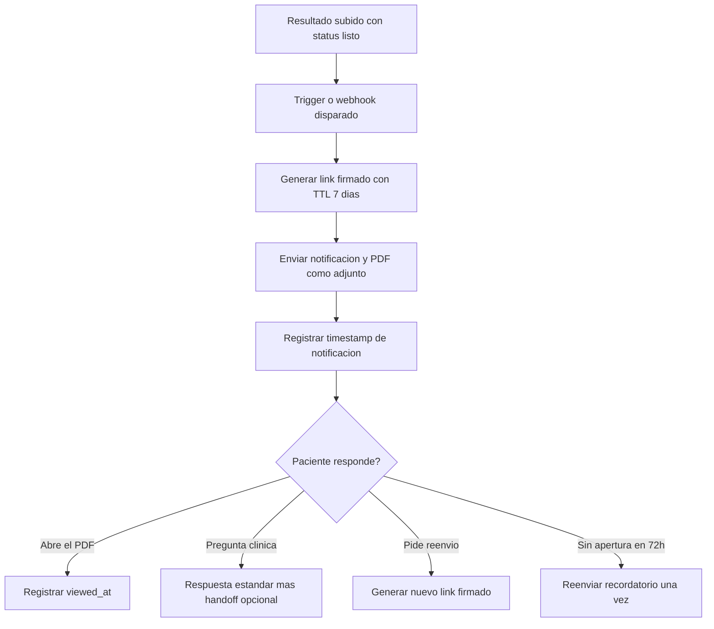

# 05 · Entrega de resultados

> **Canal:** WhatsApp Concierge · **Actor:** Bot → Paciente · **v1**

## 1. Propósito
Notificar al paciente cuando sus resultados están listos y entregarle el PDF por WhatsApp con link firmado de respaldo.

## 2. Precondiciones
- Resultado subido a Supabase Storage por secretaria (o integración LIS/PACS)
- Status del resultado = listo y notify_patient = true

## 3. Happy path

## 4. Mensajes del bot

> **Bot:** «Hola Ana, ya están tus resultados 📄
> **Química 27 elementos** — 27 may
> [📎 resultado.pdf]
> Tu médico es quien los interpreta. Si quieres consulta, escribe *agendar*.»

> **Paciente:** «mis valores están altos?»
> **Bot:** «No puedo interpretar valores médicos. Te recomiendo verlo con tu médico. ¿Te conecto con el equipo para agendar?»

## 5. Edge cases

| # | Caso | Manejo |
|---|---|---|
| E1 | Pregunta de interpretación clínica | Respuesta canned + opción de agendar |
| E2 | PDF mayor a 16 MB | Enviar solo link, no adjunto |
| E3 | Resultado marcado como crítico | No entregar por bot. Notificación urgente a secretaria/médico |
| E4 | Paciente no abre en 72h | Reenviar una vez |
| E5 | Link expirado | Bot ofrece regenerar |
| E6 | Quiere copia impresa | Indicar pasar a recepción con nombre |

## 6. Escalación a humano
- **Disparadores:** resultado crítico (siempre) · angustia o miedo del paciente
- **Notificación CRM:** prioridad alta si resultado crítico

## 7. Métricas de éxito
- Resultados notificados en menos de 5 min: >95%
- PDF abiertos por el paciente: >75%
- Llamadas pidiendo resultados: reducción ≥60%

## 8. Pendientes / v2
- Resumen en lenguaje claro con disclaimer médico
- Comparativo contra resultado previo
- Viewer DICOM para imagen
