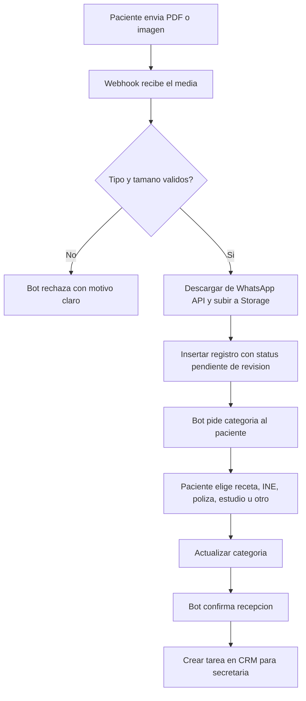

# 06 · Intake de documentos

> **Canal:** WhatsApp Concierge · **Actor:** Paciente · **v1**

## 1. Propósito
Recibir documentos del paciente por WhatsApp (receta, INE, póliza, estudios previos), guardarlos vía la API de TASI automáticamente y notificar a la secretaria para validación.

> El bot solo recibe, etiqueta y guarda. La validación y procesamiento es 100% humana.

## 2. Precondiciones
- Paciente identificado (journey 00)
- Endpoint de carga de documentos de TASI disponible
- Tipos aceptados: PDF, JPG, PNG, máximo 10 MB

## 3. Happy path

## 4. Mensajes del bot

> **Paciente:** [envía PDF]
> **Bot:** «Recibí tu documento 📄 (1.2 MB).
> ¿Qué es?
> 1️⃣ Receta médica  2️⃣ Identificación (INE)
> 3️⃣ Póliza de seguro  4️⃣ Estudio previo  5️⃣ Otro»
> **Paciente:** «1»
> **Bot:** «Listo, guardado como **receta médica**. El equipo lo revisa y asocia a tu expediente.»

## 5. Edge cases

| # | Caso | Manejo |
|---|---|---|
| E1 | Archivo mayor a 10 MB | Rechazar: pedir versión más ligera |
| E2 | Formato no soportado (.docx, audio) | Rechazar: solo PDF o foto JPG/PNG |
| E3 | Varios documentos seguidos | Encolar y pedir categoría de cada uno |
| E4 | Foto borrosa o ilegible | Secretaria lo detecta en revisión y pide reenvío |
| E5 | Asociar doc a cita específica | Bot pregunta y referencia el appointment |
| E6 | Mismo documento enviado varias veces | No deduplicar en v1, secretaria limpia |

## 6. Escalación a humano
- Todo documento entra a cola de revisión humana (flujo normal, no excepción)
- **Notificación CRM:** aparece en bandeja «Documentos por revisar»

## 7. Métricas de éxito
- Confirmación al paciente en menos de 5 s: >99%
- Documentos categorizados correctamente por paciente: >70%
- Tiempo hasta validación por secretaria: <4 h hábiles

## 8. Pendientes / v2
- OCR automático para extraer datos de receta e INE
- Auto-asociación al appointment más próximo
- Detección de imagen borrosa
