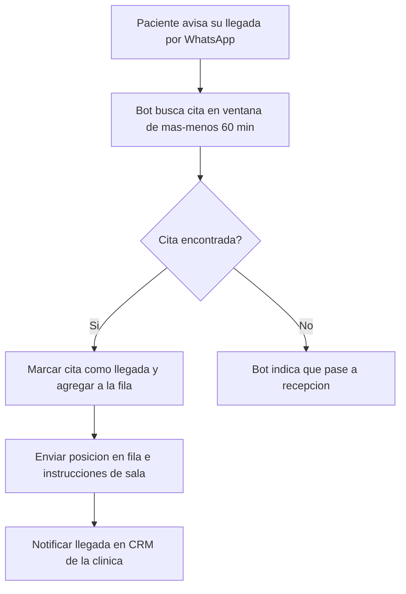

# 07 · Check-in de llegada

> **Canal:** WhatsApp Concierge · **Actor:** Paciente · **v1**

## 1. Propósito
Permitir al paciente avisar su llegada a la clínica desde WhatsApp, actualizando su status en sistema y agilizando la recepción.

## 2. Precondiciones
- Appointment con status confirmado y fecha dentro de ventana de 60 min
- Paciente identificado (journey 00)

## 3. Happy path

## 4. Mensajes del bot

> **Paciente:** «ya llegué»
> **Bot:** «¡Bienvenida, Ana! ✅ Te registré para **Química 27 · 7:30 a.m.**
> 📍 Pasa a la **Sala B** (planta baja). Eres la 2.ª en fila (~8 min).»

> **Sin cita cercana:**
> **Bot:** «No veo una cita tuya en la próxima hora. Acércate a recepción y te orientamos. ¿Te paso con el equipo?»

## 5. Edge cases

| # | Caso | Manejo |
|---|---|---|
| E1 | Llega más de 30 min tarde | Handoff para ver si pueden recibirla o reagendar |
| E2 | Llega más de 60 min antes | Informar hora real y preguntar si espera |
| E3 | Ya hizo check-in previamente | Confirmar posición actual en fila |
| E4 | Llega a clínica equivocada | Informar clínica correcta |
| E5 | Reporta síntoma grave al llegar | Prioridad urgente en CRM + indicar ir a Urgencias si aplica |

## 6. Escalación a humano
- **Disparadores:** llegada muy tarde · clínica equivocada · síntoma reportado
- **Notificación CRM:** badge urgente si hay síntoma

## 7. Métricas de éxito
- Citas con check-in por WhatsApp: >50% en 6 meses
- Reducción de tiempo en recepción: ≥40%

## 8. Pendientes / v2
- Geolocalización opcional para validar arribo
- Notificación al paciente cuando ya es su turno
- Integración con pantalla de turnos en sala
