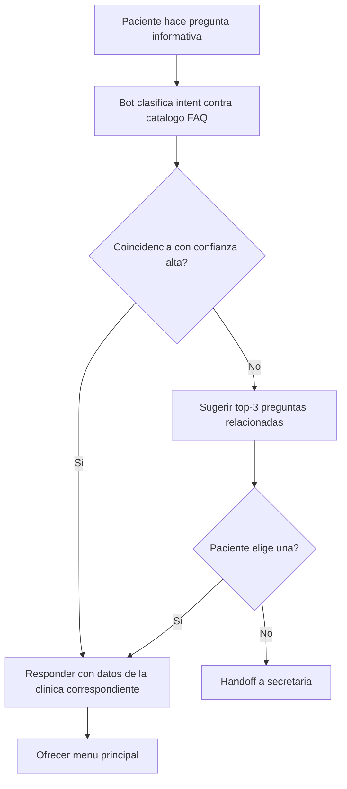

# 08 · FAQ (ubicación, horarios, estacionamiento)

> **Canal:** WhatsApp Concierge · **Actor:** Paciente · **v1**

## 1. Propósito
Responder preguntas informativas frecuentes sin intervención humana: ubicación, horarios, estacionamiento, formas de pago, accesibilidad.

## 2. Precondiciones
- Catálogo de respuestas estáticas cargado y vigente
- Paciente identificado (journey 00) para contextualizar por clínica

## 3. Happy path

## 4. Mensajes del bot

> **Paciente:** «donde están»
> **Bot:** «Tenemos varias clínicas:
> 📍 Muguerza Alta Especialidad — Hidalgo
> 📍 Muguerza Sur — Contry · San Pedro
> 📍 Spoke Saltillo — Sendero
> ¿Cuál te queda más cerca?»

> **Bot (detalle):** «📍 **Muguerza Sur**
> Calzada del Valle 400, San Pedro
> 🕐 L–V 7:00–20:00 · Sáb 8:00–14:00
> 🅿️ Estacionamiento gratis 3 h con validación
> ♿ Acceso para silla de ruedas»

## 5. Catálogo de intents v1

| Intent | Ejemplos | Respuesta |
|---|---|---|
| ubicacion | donde están, dirección, cómo llegar | Lista de clínicas + Maps URL |
| horarios | a qué hora abren, horarios | Horario por clínica |
| estacionamiento | hay parking, valet | Info por clínica |
| formas_pago | aceptan tarjeta, efectivo | Lista de medios |
| accesibilidad | silla de ruedas, elevador | Info por clínica |
| que_llevar | qué traigo, necesito algo | Lista por tipo de estudio |
| ayuno | tengo que estar en ayuno | Por servicio |
| contacto | teléfono, email | Datos de clínica |

## 6. Edge cases

| # | Caso | Manejo |
|---|---|---|
| E1 | Pregunta sobre aseguradora | Handoff inmediato |
| E2 | Pregunta clínica (síntoma, dolor) | Nunca responder, handoff + aviso |
| E3 | Intent sin match | Top-3 sugerencias + opción de hablar con equipo |
| E4 | Mismo intent 3 veces sin resolución | Handoff automático |
| E5 | Pregunta sobre médico específico | Handoff en v1 |

## 7. Métricas de éxito
- FAQ resueltas sin humano: >85%
- Tiempo de respuesta: <5 s
- Top-5 intents con más hits: revisión mensual

## 8. Pendientes / v2
- Catálogo de médicos por especialidad con disponibilidad
- Tiempos de espera en tiempo real
- Multilingüe (inglés)
