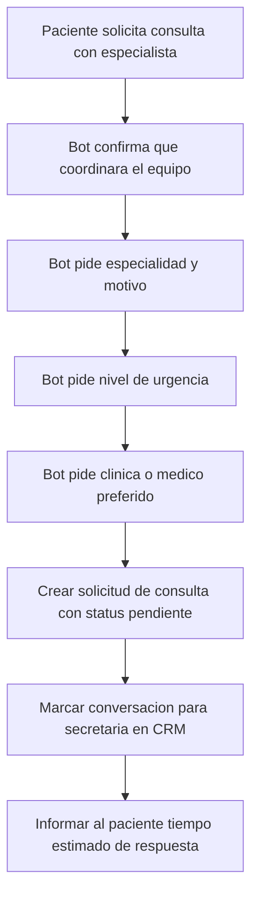

# 09 · Derivar a consulta de especialidad

> **Canal:** WhatsApp Concierge · **Actor:** Paciente · **v1**

## 1. Propósito
Cuando el paciente solicita una consulta con especialista, el bot recoge datos clave y pasa la solicitud a la secretaria con contexto completo. El bot no agenda consultas directamente en v1.

## 2. Precondiciones
- Paciente identificado (journey 00)
- Bot detecta intención de consulta

## 3. Happy path

## 4. Mensajes del bot

> **Paciente:** «quiero ver a un cardiólogo»
> **Bot:** «El equipo te coordina la cita. Dame 3 datos rápidos:
> 1. **Motivo** breve (ej: dolor de pecho, chequeo, segunda opinión)
> 2. **Urgencia:** Verde - puede esperar / Amarillo - esta semana / Rojo - urgente
> 3. ¿Algún **médico o clínica** preferida? (o escribe cualquiera)»
> **Bot:** «Listo. El equipo te contacta hoy en horario hábil para confirmar. 🙏»

## 5. Edge cases

| # | Caso | Manejo |
|---|---|---|
| E1 | Urgencia marcada como roja con síntoma grave | Agregar aviso de Urgencias + prioridad alta en CRM |
| E2 | Especialidad no disponible en Muguerza | Informar al paciente, secretaria evalúa opciones |
| E3 | Paciente no completa los 3 datos | Derivar con datos parciales y nota en CRM |
| E4 | Médico específico no disponible | Secretaria valida y responde |

## 6. Escalación a humano
- Este journey siempre termina en CRM (es su único destino)
- **CRM:** solicitud aparece en bandeja ordenada por urgencia

## 7. Métricas de éxito
- Primera respuesta humana: <2 h hábiles
- Conversión solicitud → cita agendada: >80%
- Solicitudes con los 3 datos completos: >70%

## 8. Pendientes / v2
- Auto-agendado con agenda real del médico
- Triage básico (síntomas → urgencias)
- Confirmación por bot una vez agendada
