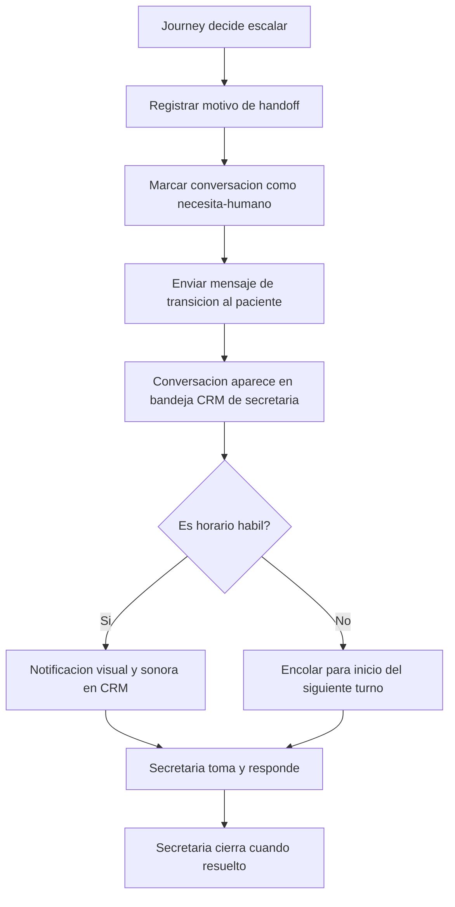

# 10 · Escalación a humano (fallback genérico)

> **Canal:** WhatsApp Concierge · **Actor:** Bot → Secretaria · **v1**

## 1. Propósito
Protocolo único para cuando el bot transfiere una conversación a la secretaria. Todos los journeys que decidan escalar terminan aquí.

## 2. Precondiciones
- Conversación activa en WhatsApp Business API
- Secretaria disponible en CRM (o encolar si fuera de horario)

## 3. Catálogo de disparadores

| Categoría | Disparador | Prioridad |
|---|---|---|
| Petición explícita | Paciente escribe humano, persona, operador | Normal |
| Aseguradora | Cualquier mención a póliza o cobertura | Normal |
| Fuera de catálogo | Cirugía, paquete, servicio no bot-eable | Normal |
| Documento | Upload completado (siempre va a revisión) | Baja |
| Fallo NLU | 3 intentos sin entender | Normal |
| Clínico urgente | Síntoma grave, dolor intenso, emergencia | Urgente |
| Emocional | Angustia, miedo, queja seria | Alta |
| Fuera de horario | Mensaje entre 20:00 y 08:00 | Encolar |

## 4. Happy path

## 5. Mensajes del bot

**Normal:**
> «Te paso con una compañera del equipo. Te responde en breve (L–V 8am–8pm, S 8am–2pm). 🙌»

**Urgente clínico:**
> «⚠️ Si es urgencia médica, llama al **911** o ve a Urgencias. Aviso al equipo ahora.»

**Fuera de horario:**
> «Recibí tu mensaje. El equipo te contesta mañana a las 8am. Si es urgencia médica, llama al 911.»

## 6. Edge cases

| # | Caso | Manejo |
|---|---|---|
| E1 | Secretaria no toma en 30 min en horario | Re-notificar o escalar a supervisor |
| E2 | Paciente sigue escribiendo tras handoff | Bot almacena mensajes para la secretaria |
| E3 | Handoff por error del bot | Secretaria puede devolver al bot desde CRM |
| E4 | Contenido inapropiado del paciente | Botón reportar/bloquear en CRM |
| E5 | Paciente expresa autolesión o ideación suicida | Prioridad urgente + protocolo de crisis + alerta supervisor |

## 7. Métricas de éxito
- Tiempo bot a primera respuesta humana en horario: <5 min
- Porcentaje de handoffs justificados: >90%
- Conversaciones resueltas por secretaria sin re-escalar: >95%

## 8. Pendientes / v2
- Dispatch automático a secretaria con menos carga
- Sugerencia de respuesta con AI assist
- Tipificación automática de conversación
